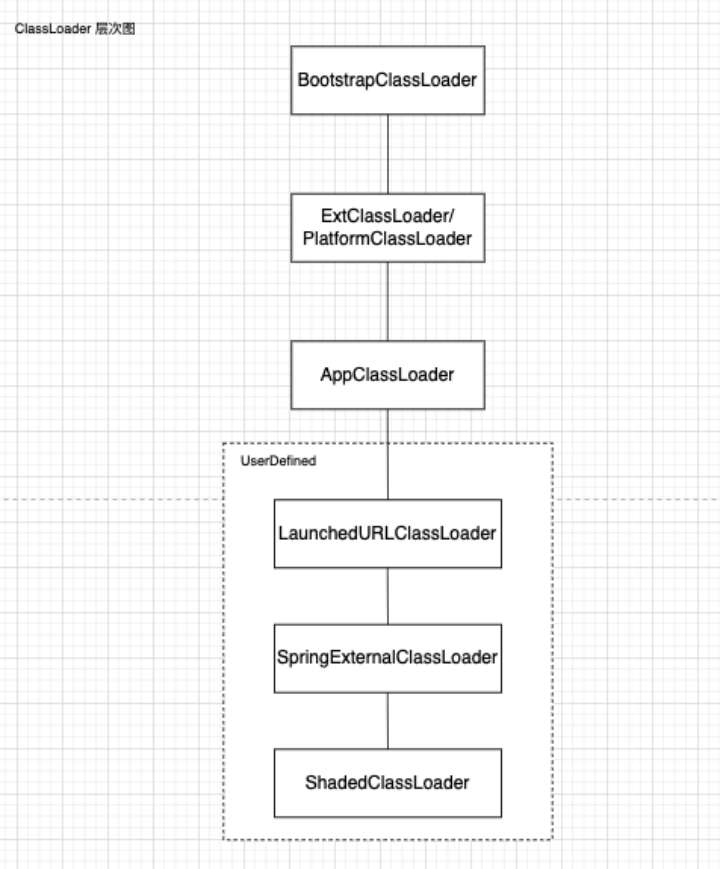

# 目录说明

``` markdown
- .
├── JavaAgent
│   ├── consoleAgent //简单的app
│   └── springAgentDemo//验证注入spring 的app demo
└── agentdemo
    ├── builds //公共的全部依赖打包项目-已废弃
    ├── consoleAgentInject//使用bytebuddy AgentBuidler创建的简单agent，不使用ByteBuddy Agent
    ├── popertiesLauncher //验证spring -Dload.path 的依赖包
    └── springAgentInject //验证spring 注入的agent demo
```

## 问题

将扩展的jar包注入spring，实现spring 启动扫描扩展jar包和本身的fat jar内容

### 以下为寻找解决方案过程中值得记录的内容

问题：将jar包的URL直接注入到 LaunchedURLClassLoader 的方式，发现bean 正常生成，但是注解不生效，不mapping，以下为追溯的历程
原因：通过ASM的ClassVisitor读取的时候，meta属性读取到了anntion，但是通过CL加载的ClassType并不能直接读取到，并且不报错，具体吞掉异常的位置为sun.reflect.annotation.AnnotationParser#parseAnnotation2
报错，异常为 [TypeNotPresentException](https://docs.oracle.com/javase%2F8%2Fdocs%2Fapi%2F%2F/java/lang/TypeNotPresentException.html)
追溯类：RequestMappingHandlerMapping->AnnotatedElementUtils->MergedAnnotations->TypeMappedAnnotations->AnnotationsScanner->
Class->AnnotationParser

PS:JDK的代码建议看JDK源码，反编译没有注释，很痛苦

```java
public class RequestMappingHandlerMapping extends RequestMappingInfoHandlerMapping
        implements MatchableHandlerMapping, EmbeddedValueResolverAware {
	/**
	 * {@inheritDoc}
	 * <p>Expects a handler to have either a type-level @{@link Controller}
	 * annotation or a type-level @{@link RequestMapping} annotation.
	 */
	@Override
	protected boolean isHandler(Class<?> beanType) {
		return (AnnotatedElementUtils.hasAnnotation(beanType, Controller.class) ||
				AnnotatedElementUtils.hasAnnotation(beanType, RequestMapping.class));
	}
}
```

```java
final class TypeMappedAnnotations implements MergedAnnotations {
    static MergedAnnotations from(AnnotatedElement element, SearchStrategy searchStrategy,
                                  RepeatableContainers repeatableContainers, AnnotationFilter annotationFilter) {

        if (AnnotationsScanner.isKnownEmpty(element, searchStrategy)) {
            return NONE;
        }
        return new TypeMappedAnnotations(element, searchStrategy, repeatableContainers, annotationFilter);
    }
}
```

```java
abstract class AnnotationsScanner {
    static boolean isKnownEmpty(AnnotatedElement source, SearchStrategy searchStrategy) {
        if (hasPlainJavaAnnotationsOnly(source)) {
            return true;
        }
        if (searchStrategy == SearchStrategy.DIRECT || isWithoutHierarchy(source, searchStrategy)) {
            if (source instanceof Method && ((Method) source).isBridge()) {
                return false;
            }
            return getDeclaredAnnotations(source, false).length == 0;
        }
        return false;
    }

    static Annotation[] getDeclaredAnnotations(AnnotatedElement source, boolean defensive) {
        boolean cached = false;
        Annotation[] annotations = declaredAnnotationCache.get(source);
        if (annotations != null) {
            cached = true;
        } else {
            //这句代码是关键
            annotations = source.getDeclaredAnnotations();
            if (annotations.length != 0) {
                boolean allIgnored = true;
                for (int i = 0; i < annotations.length; i++) {
                    Annotation annotation = annotations[i];
                    if (isIgnorable(annotation.annotationType()) ||
                            !AttributeMethods.forAnnotationType(annotation.annotationType()).isValid(annotation)) {
                        annotations[i] = null;
                    } else {
                        allIgnored = false;
                    }
                }
                annotations = (allIgnored ? NO_ANNOTATIONS : annotations);
                if (source instanceof Class || source instanceof Member) {
                    declaredAnnotationCache.put(source, annotations);
                    cached = true;
                }
            }
        }
        if (!defensive || annotations.length == 0 || !cached) {
            return annotations;
        }
        return annotations.clone();
    }
}
```

```java
public final class Class<T> implements java.io.Serializable,
        GenericDeclaration,
        Type,
        AnnotatedElement {

    private AnnotationData annotationData() {
        while (true) { // retry loop
            AnnotationData annotationData = this.annotationData;
            int classRedefinedCount = this.classRedefinedCount;
            if (annotationData != null &&
                    annotationData.redefinedCount == classRedefinedCount) {
                return annotationData;
            }
            // null or stale annotationData -> optimistically create new instance
            AnnotationData newAnnotationData = createAnnotationData(classRedefinedCount);
            // try to install it
            if (Atomic.casAnnotationData(this, annotationData, newAnnotationData)) {
                // successfully installed new AnnotationData
                return newAnnotationData;
            }
        }
    }

    private AnnotationData createAnnotationData(int classRedefinedCount) {
        Map<Class<? extends Annotation>, Annotation> declaredAnnotations =
                AnnotationParser.parseAnnotations(getRawAnnotations(), getConstantPool(), this);
        Class<?> superClass = getSuperclass();
        Map<Class<? extends Annotation>, Annotation> annotations = null;
        if (superClass != null) {
            Map<Class<? extends Annotation>, Annotation> superAnnotations =
                    superClass.annotationData().annotations;
            for (Map.Entry<Class<? extends Annotation>, Annotation> e : superAnnotations.entrySet()) {
                Class<? extends Annotation> annotationClass = e.getKey();
                if (AnnotationType.getInstance(annotationClass).isInherited()) {
                    if (annotations == null) { // lazy construction
                        annotations = new LinkedHashMap<>((Math.max(
                                declaredAnnotations.size(),
                                Math.min(12, declaredAnnotations.size() + superAnnotations.size())
                        ) * 4 + 2) / 3
                        );
                    }
                    annotations.put(annotationClass, e.getValue());
                }
            }
        }
        if (annotations == null) {
            // no inherited annotations -> share the Map with declaredAnnotations
            annotations = declaredAnnotations;
        } else {
            // at least one inherited annotation -> declared may override inherited
            annotations.putAll(declaredAnnotations);
        }
        return new AnnotationData(annotations, declaredAnnotations, classRedefinedCount);
    }

    /**
     * @since 1.5
     */
    public Annotation[] getDeclaredAnnotations() {
        return AnnotationParser.toArray(annotationData().declaredAnnotations);
    }

}
```

```java
//AnnotationParser 在JDK中有个类，是这个包下的
package sun.reflect.annotation;

public class AnnotationParser {
    /*
     * This method converts the annotation map returned by the parseAnnotations()
     * method to an array.  It is called by Field.getDeclaredAnnotations(),
     * Method.getDeclaredAnnotations(), and Constructor.getDeclaredAnnotations().
     * This avoids the reflection classes to load the Annotation class until
     * it is needed.
     */
    private static final Annotation[] EMPTY_ANNOTATION_ARRAY = new Annotation[0];

    public static Annotation[] toArray(Map<Class<? extends Annotation>, Annotation> annotations) {
        return annotations.values().toArray(EMPTY_ANNOTATION_ARRAY);
    }

    /**
     * Parses the annotation at the current position in the specified
     * byte buffer, resolving constant references in the specified constant
     * pool.  The cursor of the byte buffer must point to an "annotation
     * structure" as described in the RuntimeVisibleAnnotations_attribute:
     *
     * annotation {
     *    u2    type_index;
     *       u2    num_member_value_pairs;
     *       {    u2    member_name_index;
     *             member_value value;
     *       }    member_value_pairs[num_member_value_pairs];
     *    }
     * }
     *
     * Returns the annotation, or null if the annotation's type cannot
     * be found by the VM, or is not a valid annotation type.
     *
     * @param exceptionOnMissingAnnotationClass if true, throw
     * TypeNotPresentException if a referenced annotation type is not
     * available at runtime
     */
    static Annotation parseAnnotation(ByteBuffer buf,
                                      ConstantPool constPool,
                                      Class<?> container,
                                      boolean exceptionOnMissingAnnotationClass) {
        return parseAnnotation2(buf, constPool, container, exceptionOnMissingAnnotationClass, null);
    }

    private static Map<Class<? extends Annotation>, Annotation> parseAnnotations2(
            byte[] rawAnnotations,
            ConstantPool constPool,
            Class<?> container,
            Class<? extends Annotation>[] selectAnnotationClasses) {
        Map<Class<? extends Annotation>, Annotation> result =
                new LinkedHashMap<Class<? extends Annotation>, Annotation>();
        ByteBuffer buf = ByteBuffer.wrap(rawAnnotations);
        int numAnnotations = buf.getShort() & 0xFFFF;
        for (int i = 0; i < numAnnotations; i++) {
            Annotation a = parseAnnotation2(buf, constPool, container, false, selectAnnotationClasses);
            if (a != null) {
                Class<? extends Annotation> klass = a.annotationType();
                if (AnnotationType.getInstance(klass).retention() == RetentionPolicy.RUNTIME &&
                        result.put(klass, a) != null) {
                    throw new AnnotationFormatError(
                            "Duplicate annotation for class: " + klass + ": " + a);
                }
            }
        }
        return result;
    }
}
```

## 解决方案

通过创建自定义 SpringExternalClassLoader和ShadedClassLoader，覆盖当前线程的上下文的spring 的 LaunchedURLClassLoader，解决不能加载引入包的问题；类的层级如下：


### 为什么要实现两个ClassLoader？
追溯类：ClassPathBeanDefinitionScanner->ClassPathScanningCandidateComponentProvider->PathMatchingResourcePatternResolver->ClassLoader
```java
public class ClassPathBeanDefinitionScanner extends ClassPathScanningCandidateComponentProvider {
/**
	 * Perform a scan within the specified base packages,
	 * returning the registered bean definitions.
	 * <p>This method does <i>not</i> register an annotation config processor
	 * but rather leaves this up to the caller.
	 * @param basePackages the packages to check for annotated classes
	 * @return set of beans registered if any for tooling registration purposes (never {@code null})
	 */
	protected Set<BeanDefinitionHolder> doScan(String... basePackages) {
		Assert.notEmpty(basePackages, "At least one base package must be specified");
		Set<BeanDefinitionHolder> beanDefinitions = new LinkedHashSet<>();
		for (String basePackage : basePackages) {
			Set<BeanDefinition> candidates = findCandidateComponents(basePackage);
			for (BeanDefinition candidate : candidates) {
				ScopeMetadata scopeMetadata = this.scopeMetadataResolver.resolveScopeMetadata(candidate);
				candidate.setScope(scopeMetadata.getScopeName());
				String beanName = this.beanNameGenerator.generateBeanName(candidate, this.registry);
				if (candidate instanceof AbstractBeanDefinition) {
					postProcessBeanDefinition((AbstractBeanDefinition) candidate, beanName);
				}
				if (candidate instanceof AnnotatedBeanDefinition) {
					AnnotationConfigUtils.processCommonDefinitionAnnotations((AnnotatedBeanDefinition) candidate);
				}
				if (checkCandidate(beanName, candidate)) {
					BeanDefinitionHolder definitionHolder = new BeanDefinitionHolder(candidate, beanName);
					definitionHolder =
							AnnotationConfigUtils.applyScopedProxyMode(scopeMetadata, definitionHolder, this.registry);
					beanDefinitions.add(definitionHolder);
					registerBeanDefinition(definitionHolder, this.registry);
				}
			}
		}
		return beanDefinitions;
	}
}
```
```java
public class ClassPathScanningCandidateComponentProvider implements EnvironmentCapable, ResourceLoaderAware {
    private Set<BeanDefinition> scanCandidateComponents(String basePackage) {
        Set<BeanDefinition> candidates = new LinkedHashSet<>();
        try {
            String packageSearchPath = ResourcePatternResolver.CLASSPATH_ALL_URL_PREFIX +
                    resolveBasePackage(basePackage) + '/' + this.resourcePattern;
            //这里是关键，获取所有的资源
            Resource[] resources = getResourcePatternResolver().getResources(packageSearchPath);
            boolean traceEnabled = logger.isTraceEnabled();
            boolean debugEnabled = logger.isDebugEnabled();
            for (Resource resource : resources) {
                //do something
            }
        } catch (IOException ex) {
            throw new BeanDefinitionStoreException("I/O failure during classpath scanning", ex);
        }
        return candidates;
    }
}
```
```java
public class PathMatchingResourcePatternResolver implements ResourcePatternResolver {
    @Override
    public Resource[] getResources(String locationPattern) throws IOException {
        Assert.notNull(locationPattern, "Location pattern must not be null");
        if (locationPattern.startsWith(CLASSPATH_ALL_URL_PREFIX)) {
            // a class path resource (multiple resources for same name possible)
            if (getPathMatcher().isPattern(locationPattern.substring(CLASSPATH_ALL_URL_PREFIX.length()))) {
                // a class path resource pattern；这里执行
                return findPathMatchingResources(locationPattern);
            } else {
                // all class path resources with the given name
                return findAllClassPathResources(locationPattern.substring(CLASSPATH_ALL_URL_PREFIX.length()));
            }
        } else {
            // Generally only look for a pattern after a prefix here,
            // and on Tomcat only after the "*/" separator for its "war:" protocol.
            int prefixEnd = (locationPattern.startsWith("war:") ? locationPattern.indexOf("*/") + 1 :
                    locationPattern.indexOf(':') + 1);
            if (getPathMatcher().isPattern(locationPattern.substring(prefixEnd))) {
                // a file pattern
                return findPathMatchingResources(locationPattern);
            } else {
                // a single resource with the given name
                return new Resource[]{getResourceLoader().getResource(locationPattern)};
            }
        }
    }
    protected Resource[] findAllClassPathResources(String location) throws IOException {
        String path = location;
        if (path.startsWith("/")) {
            path = path.substring(1);
        }
        Set<Resource> result = doFindAllClassPathResources(path);
        if (logger.isTraceEnabled()) {
            logger.trace("Resolved classpath location [" + location + "] to resources " + result);
        }
        return result.toArray(new Resource[0]);
    }

    protected Set<Resource> doFindAllClassPathResources(String path) throws IOException {
        Set<Resource> result = new LinkedHashSet<>(16);
        ClassLoader cl = getClassLoader();
        //最终是调用了 cl.getResources(path)
        Enumeration<URL> resourceUrls = (cl != null ? cl.getResources(path) : ClassLoader.getSystemResources(path));
        while (resourceUrls.hasMoreElements()) {
            URL url = resourceUrls.nextElement();
            result.add(convertClassLoaderURL(url));
        }
        if (!StringUtils.hasLength(path)) {
            // The above result is likely to be incomplete, i.e. only containing file system references.
            // We need to have pointers to each of the jar files on the classpath as well...
            addAllClassLoaderJarRoots(cl, result);
        }
        return result;
    }
}
```
```java
public abstract class ClassLoader {
    public Enumeration<URL> getResources(String name) throws IOException {
        @SuppressWarnings("unchecked")
        Enumeration<URL>[] tmp = (Enumeration<URL>[]) new Enumeration<?>[2];
        if (parent != null) {
            //这条语句很关键
            tmp[0] = parent.getResources(name);
        } else {
            tmp[0] = getBootstrapResources(name);
        }
        tmp[1] = findResources(name);

        return new CompoundEnumeration<>(tmp);
    }
}
```
```java
/**
 *
 * 支持在 spring class path 扫描的时刻动态加载额外的class path jar包的CL
 * @author wzg
 * @date 2024/5/7 13:34
 */
public class SpringExternalClassLoader extends URLClassLoader {
    @Override
    public Enumeration<URL> getResources(String name) throws IOException {
        System.out.println(this + "|getResources enter");
        // look locally first
        Enumeration<URL> shadedResources = findResources(name);
        if (shadedResources.hasMoreElements()) {
            //这里写入扩展的jar包
            if (isNotEmpty(name) && name.equals(springClassPath)) {
                return setClassLocator(name, shadedResources);
            }
            return shadedResources;
        }
        // if not found locally, calling super's lookup, which does parent first and then local, so marking as not required for local lookup
        Set<String> locallyNonAvailableResources = this.locallyNonAvailableResources.get();
        try {
            locallyNonAvailableResources.add(name);
            //这里写入扩展的jar包
            if (isNotEmpty(name) && name.equals(springClassPath)) {
                System.out.println(this + "|name:" + name + "|setClassLocator");
                return setClassLocator(name, this.getParent().getResources(name));
            } else {
                //LaunchedURLClassLoader 获取
//                System.out.println(this+"|name:"+name+"|getParent:"+this.getParent());
                return this.getParent().getResources(name);
            }
        } catch (Exception ex) {
            ex.printStackTrace();
            return ClassLoader.getSystemClassLoader().getResources(name);
        } finally {
            locallyNonAvailableResources.remove(name);
        }
    }
}
```

### SpringExternalClassLoader和ShadedClassLoader 为什么要实现 getResourceAsStream?

```java
class ClassPathResource extends InputStreamSource {
    @Override
    public InputStream getInputStream() throws IOException {
        InputStream is;
        if (this.clazz != null) {
            is = this.clazz.getResourceAsStream(this.path);
        } else if (this.classLoader != null) {
            //这里是最关键的点，所以我们必须在 SpringExternalClassLoader 和 ShadedClassLoader 中实现 getResourceAsStream
            is = this.classLoader.getResourceAsStream(this.path);
        } else {
            is = ClassLoader.getSystemResourceAsStream(this.path);
        }
        if (is == null) {
            throw new FileNotFoundException(getDescription() + " cannot be opened because it does not exist");
        }
        return is;
    }
}
```
### 资源加载顺序
资源首先在SpringExternalClassLoader 进行加载，如果没有资源，则去 parent CL加载。
## 附加调试

### 启动添加参数配置

``` bat
java -javaagent:/Users/zhanguowang/Desktop/project/github/java-agent-example/agentdemo/springAgentInject/target/springAgentInject-1-SNAPSHOT.jar -agentlib:jdwp=transport=dt_socket,server=y,suspend=n,address=9999 -jar springAgentDemo-0.0.1-SNAPSHOT.jar
```
PS：本地调试地址换为自己的地址；也可以见 run.sh
### idea 增加远程调试

host：localhost 端口使用9999


